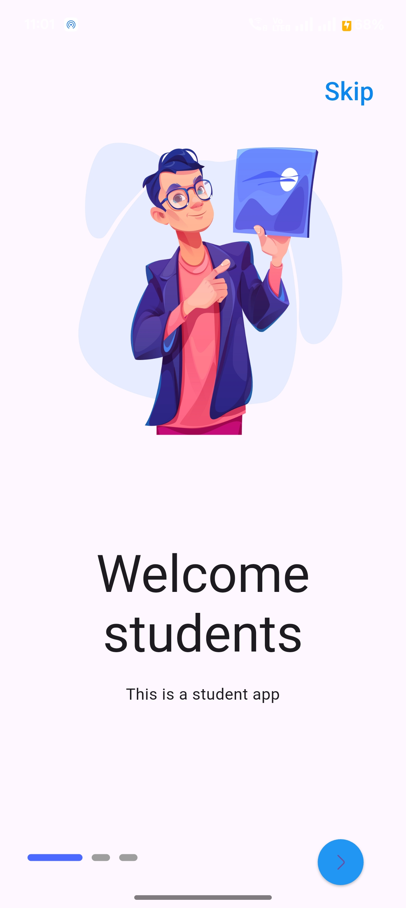
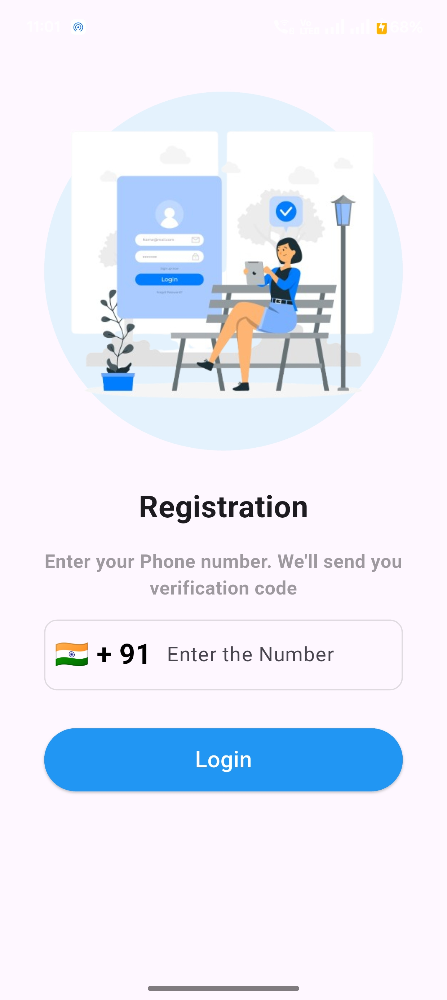
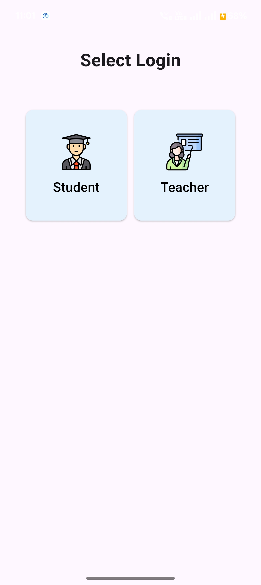
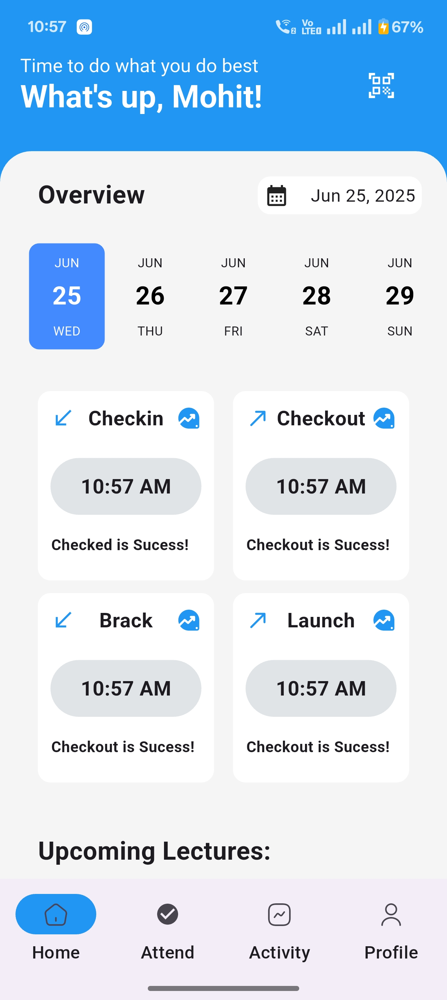
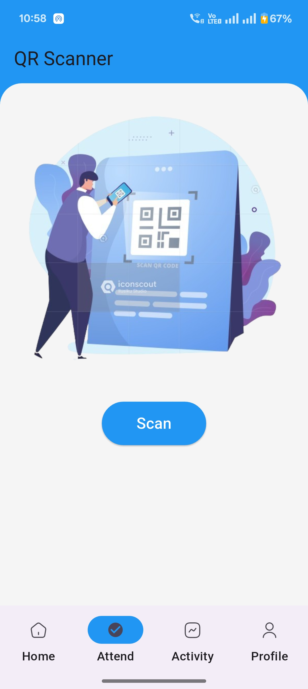
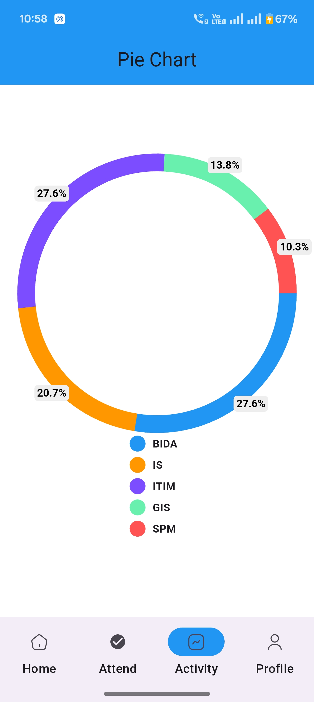
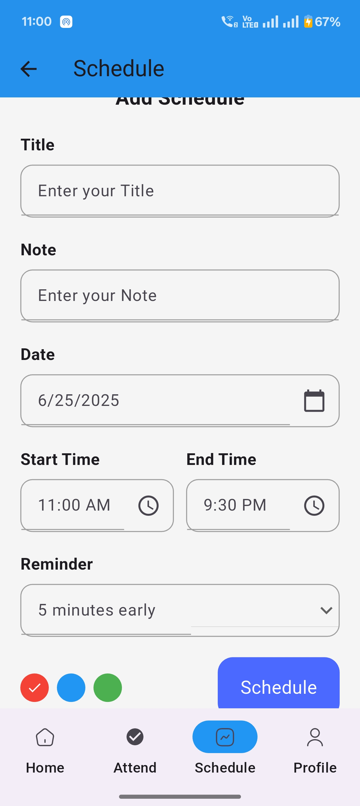
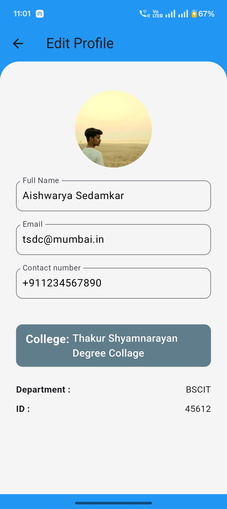

# 📲 NoProxyS1 - QR Code Attendance App

A modern, mobile-first Flutter app built to manage student & teacher attendance using QR code scanning. Powered by Firebase, and styled with intuitive user interfaces.

## 🚀 Features
- 📅 Schedule Lectures
- ✅ QR Code Attendance (Scan to Checkin)
- 📊 Attendance Pie Charts by Subject
- 👥 Separate Student/Teacher Logins
- 🔒 OTP-based Auth (Firebase)
- 🔄 Realtime Firestore Database
- 📈 Personal Attendance Records
- 🧑‍🎓 Profile with College, Department, ID
- 🔔 Lecture Reminders & Notification Panel (planned)

## 📸 UI Preview

<table>
  <tr>
    <td></td>
    <td></td>
    <td></td>
  </tr>
  <tr>
    <td></td>
    <td></td>
    <td></td>
  </tr>
  <tr>
    <td></td>
    <td></td>
  </tr>
</table>

## 🛠️ Built With
- Flutter 3.x
- Firebase Auth
- Cloud Firestore
- firebase_ui_auth
- QR Code Scanner (flutter_barcode_scanner)
- fl_chart (for pie chart)
- SharedPreferences (login role)

## 📌 Upcoming Features
- [ ] Admin Web Portal for QR Code & Reporting
- [ ] Export Attendance to Excel/CSV
- [ ] Class-wise Teacher View
- [ ] Offline Attendance Saving
- [ ] Push Notifications

## 🙋 Author
**Mohit Singh**  
[LinkedIn](https://linkedin.com/in/wtffmohits)  
GitHub: [wtffmohits](https://github.com/wtffmohits)

